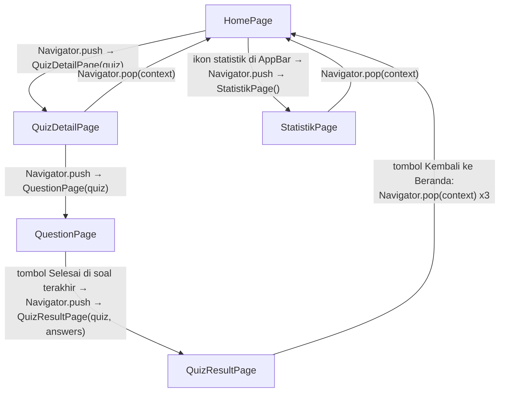

# PROJECTMAP — MBQ — My Belajar Quiz (UTS Mobile Programming SI34006)

> **Dokumen ini adalah peta kerja utama untuk fase coding.** Semua nama file, class, dan halaman di sini HARUS identik dengan [README.md](README.md) dan dengan kode yang akan ditulis.

---

## 1. Ringkasan Project & Prinsip Desain

MBQ (My Belajar Quiz) adalah aplikasi kuis interaktif (Flutter, Android) untuk UTS Mobile Programming. Fokus penilaian adalah **UI, layout, dan pemilihan widget yang tepat**, sehingga aplikasi dibangun dengan widget Pertemuan 1–4, data dummy statis tanpa database, navigasi dengan `Navigator.push(MaterialPageRoute)`/`Navigator.pop`, dan interaksi dasar dengan `GestureDetector` + `setState()`. Aplikasi terdiri dari 5 halaman (4 wajib + 1 tambahan) yang datanya mengalir satu arah: Home → Detail → Question → Result. Seluruh data dummy bertema **Quiz Sejarah Umum** (tokoh, tempat, dan peristiwa penting dalam sejarah dunia dan Indonesia).

**Konvensi (wajib diikuti fase coding):**
- **Naming:** file `snake_case.dart`; class `PascalCase`; variabel/method `lowerCamelCase`; field private di class State pakai prefix underscore (`_currentIndex`).
- **Identifier dalam bahasa Inggris**, **komentar dalam bahasa Indonesia** (`// tombol kembali ke beranda`).
- **Constructor posisional** untuk mengirim data antar halaman, meniru gaya class `Mahasiswa` di M1: `const QuizDetailPage(this.quiz, {super.key});`. Halaman yang menerima data tidak bisa dipanggil dengan `const` (`QuizDetailPage(quiz)`), itu wajar.
- **`const` di mana pun memungkinkan** (widget statis seperti `const Text(...)`, `const SizedBox(...)`), konsisten dengan contoh dosen (`const MyApp({super.key})`).
- **Widget reusable hanya tampilan.** `AnswerOptionCard` dan `StatBar` tidak menerima fungsi/callback (parameter fungsi belum diajarkan). `GestureDetector` + `setState` dipasang di halaman pemilik state, lalu membungkus widget tampilan tersebut.
- **Kode harus runnable apa adanya**: lengkap dengan `import`, tanpa referensi ke package eksternal.
- Tidak memakai widget input P5–P6 sebagai solusi utama; setiap widget/teknik di luar M1–4 **wajib diberi label [Outside material]** + alasan + alternatif.
- Dart dasar yang dipakai: class/constructor/method, `final`/`const`, nullable `?`, `if`/`else`, `for` biasa (hanya untuk logika hitung skor), ternary `a ? b : c` (ada di contoh dosen `_favorit ? ... : ...`), string interpolation `$nama`. **Tidak dipakai:** `.map().toList()`, collection-`for`/`if` di dalam `children`, `ListView.builder`. Jumlah kartu ditulis manual karena data dummy tetap (3 kuis, mc = 4 opsi, tf = 2 opsi).

Contoh gaya kode yang diikuti (pola kartu jawaban terpilih, **ilustrasi konvensi, bukan implementasi**):

```dart
// GestureDetector ada di QuestionPage (pemilik state); kartu hanya tampilan
GestureDetector(
  onTap: () {
    setState(() {
      _answers[_currentIndex] = 2; // simpan pilihan user untuk soal ini
    });
  },
  child: AnswerOptionCard("C. Cina", _answers[_currentIndex] == 2),
)
```

---

## 2. Struktur Folder & File

```
lib/
├── main.dart                    # titik masuk: main(), runApp, MaterialApp + ThemeData (tema global)
├── theme/
│   └── mbq_colors.dart          # konstanta warna MBQ (mbqNavy, mbqNavyLight) + gaya teks (headingStyle, questionStyle)
├── models/
│   ├── quiz.dart                # class Quiz: data satu kuis (judul, kategori, durasi, daftar soal)
│   └── question.dart            # class Question: data satu soal (tipe soal, teks, opsi, kunci jawaban)
├── data/
│   └── dummy_data.dart          # List<Quiz> dummyQuizzes: 3 kuis contoh dengan 3 tipe soal
├── pages/
│   ├── home_page.dart           # halaman 1: daftar kuis + akses Statistik
│   ├── quiz_detail_page.dart    # halaman 2: detail kuis + tombol Mulai Kuis
│   ├── question_page.dart       # halaman 3: pengerjaan soal (inti aplikasi, paling kompleks)
│   ├── quiz_result_page.dart    # halaman 4: skor, benar/salah, ringkasan hasil + mini-statistik
│   └── statistik_page.dart      # halaman tambahan: rekap bar nilai per kuis
└── widgets/
    ├── quiz_card.dart           # kartu kuis di HomePage (berisi GestureDetector → Detail)
    ├── answer_option_card.dart  # kartu opsi jawaban (tampilan saja; pembungkus GestureDetector ada di QuestionPage)
    └── stat_bar.dart            # satu baris bar statistik di StatistikPage (tampilan saja)
```

---

## 3. Model Data Dummy

Gaya class mengikuti contoh `Mahasiswa` dari M1 (constructor `this.field`, tanpa package tambahan).

### Class `Quiz` (models/quiz.dart)

| Field | Tipe | Keterangan |
|---|---|---|
| `title` | `String` | Judul kuis |
| `description` | `String` | Deskripsi singkat kuis |
| `category` | `String` | Kategori (mis. "Umum", "Indonesia", "Dunia") |
| `durationMinutes` | `int` | Durasi kuis dalam menit (pengaturan timer) |
| `questions` | `List<Question>` | Daftar soal |

```dart
class Quiz {
  String title;
  String description;
  String category;
  int durationMinutes;
  List<Question> questions;

  Quiz(this.title, this.description, this.category,
      this.durationMinutes, this.questions);
}
```

### Class `Question` (models/question.dart)

| Field | Tipe | Keterangan |
|---|---|---|
| `questionText` | `String` | Teks soal |
| `type` | `String` | `"mc"` (pilihan ganda) / `"tf"` (benar-salah) / `"essay"` |
| `options` | `List<String>` | Opsi jawaban; `[]` untuk esai; `["Benar", "Salah"]` untuk tf |
| `correctIndex` | `int` | Index kunci jawaban; `-1` untuk esai (tidak dinilai otomatis) |

```dart
class Question {
  String questionText;
  String type;
  List<String> options;
  int correctIndex;

  Question(this.questionText, this.type, this.options, this.correctIndex);
}
```

> Alasan pakai `String` untuk `type` (bukan enum): enum belum eksplisit di materi M1–4, sedangkan `String` cukup untuk pembanding sederhana `question.type == "mc"`. **[Needs lecturer verification]** bila enum sudah diajarkan.

### Tema data dummy: Quiz Sejarah Umum

Seluruh data dummy bertema **Quiz Sejarah Umum**: pertanyaan seputar tokoh, tempat, penemuan, dan peristiwa penting dalam sejarah dunia dan Indonesia. Jawabannya umum diketahui sehingga mudah diverifikasi saat demo. Ada 3 kuis:

**1. "Quiz Sejarah Umum"** — kategori *Umum*, 10 menit, 6 soal, **campuran 3 tipe** (kuis inilah yang dipakai untuk screenshot ketiga tipe soal dan ringkasan di halaman hasil). Deskripsi: *"Uji pengetahuanmu tentang tokoh, tempat, dan peristiwa penting dalam sejarah dunia dan Indonesia."*

| No | Tipe | Soal | Opsi | `correctIndex` |
|---|---|---|---|---|
| 1 | `mc` | Siapa presiden pertama Amerika Serikat? | A. Abraham Lincoln · B. George Washington · C. Thomas Jefferson · D. John Adams | `1` (B) |
| 2 | `mc` | Dimana tembok besar China berada? | A. Jepang · B. Korea · C. Cina · D. Mongolia | `2` (C) |
| 3 | `mc` | Siapa penemu lampu pijar? | A. Nikola Tesla · B. Thomas Alva Edison · C. Albert Einstein · D. Alexander Graham Bell | `1` (B) |
| 4 | `mc` | Kapan Indonesia merdeka? | A. 1940 · B. 1945 · C. 1950 · D. 1965 | `1` (B) |
| 5 | `tf` | Candi Borobudur terletak di Jawa Tengah. | Benar · Salah | `0` |
| 6 | `essay` | Jelaskan secara singkat peristiwa Proklamasi Kemerdekaan Indonesia! | `[]` | `-1` |

Contoh penulisan satu soal di `dummy_data.dart` (huruf A–D ditambahkan manual di UI, tidak disimpan di data):

```dart
Question(
  "Siapa presiden pertama Amerika Serikat?",
  "mc",
  ["Abraham Lincoln", "George Washington", "Thomas Jefferson", "John Adams"],
  1, // B. George Washington
)
```

**2. "Sejarah Indonesia"** — kategori *Indonesia*, 5 menit, 5 soal → semua **benar/salah** (`tf`). Contoh: *"Proklamasi kemerdekaan Indonesia dibacakan pada 17 Agustus 1945."* → `["Benar", "Salah"]`, kunci `0`; *"Mohammad Hatta adalah presiden pertama Indonesia."* → kunci `1` (Salah). Tiga soal lain ditulis dengan pola yang sama.

**3. "Sejarah Dunia"** — kategori *Dunia*, 15 menit, 3 soal → semua **esai** (`essay`). Contoh: *"Jelaskan penyebab terjadinya Perang Dunia II secara singkat!"* → opsi `[]`, kunci `-1`. Kuis ini sengaja dipakai untuk menguji kasus "tidak ada soal yang dinilai otomatis" di halaman hasil (lihat 5.4).

Nilai dummy di `StatistikPage` (Umum 80, Indonesia 50, Dunia 40) berada di rentang 1–99 (alasan: lihat 5.5).


---

## 4. Peta Navigasi



Tumpukan halaman saat di hasil kuis: **Home → Detail → Question → Result**. Dari Result, satu `pop` hanya sampai ke Question, dua `pop` sampai ke Detail, sehingga untuk kembali ke Home dibutuhkan **tiga** `pop`.

**Aturan navigasi (semua dari materi M4):**

| Aksi | Kode |
|---|---|
| Pindah halaman | `Navigator.push(context, MaterialPageRoute(builder: (context) => QuizDetailPage(quiz)))` |
| Kembali | `Navigator.pop(context)` (tombol back AppBar juga otomatis pop) |
| Result → Home | `Navigator.pop(context);` ditulis **tiga kali** berurutan, dengan komentar `// pop Result, Question, lalu Detail → sampai di Home` |

**Pengiriman data antar halaman: lewat constructor posisional (gaya `Mahasiswa` M1), bukan named routes:**

- `HomePage` membaca `dummyQuizzes`; `QuizCard(dummyQuizzes[0])` yang diketuk mengirim objek `Quiz` → `QuizDetailPage(this.quiz)`.
- `QuizDetailPage` meneruskan `quiz` yang sama → `QuestionPage(this.quiz)`.
- `QuestionPage` mengirim `quiz` dan peta jawaban → `QuizResultPage(this.quiz, this.answers)`. `answers` bertipe `Map<int, int>`: kunci = index soal, nilai = index opsi yang dipilih. Soal esai tidak tercatat (tidak ada input).
- `QuizResultPage` menghitung sendiri skor, jumlah benar/salah, dan ringkasan per tipe dari `quiz` + `answers` (lihat 5.4).

> Catatan: `Navigator.popUntil` atau `pushAndRemoveUntil` lebih ringkas untuk kembali ke Home, tetapi keduanya **[Outside material]** (materi P4 hanya `push` dan `pop`). Rencana utama: tiga `pop` berurutan. Uji di emulator; pola ini umum dipakai dan berjalan normal.

> Akses data di class State memakai `widget.quiz` (mis. `widget.quiz.questions.length`). Properti `widget` tidak muncul di contoh dosen. **[Needs lecturer verification]**. Alternatif: tulis `final quiz = widget.quiz;` sekali di awal `build` agar kode di bawahnya lebih bersih.

---

## 5. Spesifikasi Per Halaman

### 5.1 HomePage (Quiz List)

- **File/class:** `pages/home_page.dart`, class `HomePage`.
- **Type:** `StatelessWidget`. Daftar kuis bersumber dari data dummy yang tidak berubah; tidak ada state lokal. (Interaksi ketuk hanya memicu navigasi.)
- **Data:** `import '../data/dummy_data.dart'` → `dummyQuizzes`.

**Text wireframe:**

```
┌──────────────────────────────────┐
│ AppBar: "MBQ"           [📊]     │  ← ikon bar_chart → StatistikPage
├──────────────────────────────────┤
│  Pilih Kuis                      │  ← judul section
│ ┌──────────────────────────────┐ │
│ │ 🏛  Quiz Sejarah Umum        │ │  ← QuizCard (GestureDetector)
│ │     Umum • 6 soal            │ │
│ │     ⏱ 10 menit               │ │
│ └──────────────────────────────┘ │
│ ┌──────────────────────────────┐ │
│ │ 📜  Sejarah Indonesia        │ │
│ │     Indonesia • 5 soal • 5 mnt│ │
│ └──────────────────────────────┘ │
│ ┌──────────────────────────────┐ │
│ │ 🌍  Sejarah Dunia            │ │
│ │     Dunia • 3 soal • 15 mnt  │ │
│ └──────────────────────────────┘ │
└──────────────────────────────────┘
```

**Widget tree:**

```
Scaffold
├── appBar: AppBar(title: Text("MBQ"),
│                  actions: [GestureDetector(onTap: → push StatistikPage,
│                              child: Padding(EdgeInsets.all(16), child: Icon(Icons.bar_chart)))])
└── body: SafeArea
    └── Padding(EdgeInsets.all(16))
        └── Column(crossAxisAlignment: CrossAxisAlignment.start)
            ├── Text("Pilih Kuis", style: headingStyle)
            ├── SizedBox(height: 16)
            ├── QuizCard(dummyQuizzes[0])
            ├── SizedBox(height: 8)
            ├── QuizCard(dummyQuizzes[1])
            ├── SizedBox(height: 8)
            └── QuizCard(dummyQuizzes[2])
```

> Rencana utama memakai `Column` biasa dengan 3 `QuizCard` yang ditulis manual (tanpa loop dan tanpa `ListView`), karena dummy hanya 3 kuis dan tinggi totalnya muat di layar. `ListView`/`SingleChildScrollView` belum eksplisit di M1–4 dan **tidak dipakai**. Bila kelak kuis bertambah banyak, tanyakan dulu ke dosen. **[Needs lecturer verification]**.

- **Interaksi/tombol:**
  - `QuizCard` (di dalamnya `GestureDetector.onTap`) → `Navigator.push` → `QuizDetailPage(quiz)`.
  - Ikon statistik di AppBar: `GestureDetector` membungkus `Padding` + `Icon(Icons.bar_chart)` di `actions` (bukan `IconButton`, agar tetap murni widget yang sudah diajarkan) → `Navigator.push` → `StatistikPage()`. `Padding` memperluas area ketuk.
- **State yang dikelola:** tidak ada (StatelessWidget).
- **Animasi:** tidak ada (animasi fokus di QuestionPage).
- **Responsif:** `SafeArea` (aman dari status bar/notch); `Padding` + `SizedBox` untuk spacing konsisten.
- **Opsional (fase polishing, bila waktu ada):** baris chip kategori di atas daftar (`Row` berisi `GestureDetector` + `Container`), dengan `HomePage` menjadi `StatefulWidget` yang menyimpan `_selectedCategory` (`String`). Ini memperlihatkan state P4 dan mewujudkan "kategori" dari soal UTS. Bukan bagian rencana utama.

### 5.2 QuizDetailPage

- **File/class:** `pages/quiz_detail_page.dart`, class `QuizDetailPage`.
- **Type:** `StatelessWidget`. Hanya menampilkan data `quiz` dari constructor; tidak ada perubahan state.
- **Constructor:** `const QuizDetailPage(this.quiz, {super.key});` dengan field `final Quiz quiz;`. Pemanggilnya memakai `QuizDetailPage(quiz)` tanpa `const`.

**Text wireframe:**

```
┌──────────────────────────────────┐
│ AppBar: "Detail Kuis"      [←]   │
├──────────────────────────────────┤
│ ┌──────────────────────────────┐ │
│ │ (hero card, warna navy muda) │ │
│ │ 🏛                  [Umum]   │ │  ← badge kategori (Positioned, kanan atas)
│ │ Quiz Sejarah Umum            │ │
│ └──────────────────────────────┘ │
│  Deskripsi:                      │
│  Uji pengetahuanmu tentang tokoh,│
│  tempat, dan peristiwa sejarah...│
│                                  │
│ ┌──────────────┐ ┌────────────┐  │
│ │ 📋 6 soal    │ │ ⏱ 10 menit │  │  ← Row dua info kecil (Flexible)
│ └──────────────┘ └────────────┘  │
│                                  │
│        ┌──────────────────┐      │
│        │   MULAI KUIS ▶   │      │  ← ElevatedButton
│        └──────────────────┘      │
└──────────────────────────────────┘
```

**Widget tree:**

```
Scaffold
├── appBar: AppBar(title: Text("Detail Kuis"))
└── body: SafeArea
    └── Padding(EdgeInsets.all(16))
        └── Column(crossAxisAlignment: CrossAxisAlignment.stretch)
            ├── Container(hero card: BoxDecoration color mbqNavyLight,
            │             borderRadius 12, padding 16)
            │   └── Stack
            │       ├── SizedBox(width: double.infinity,        ← melebarkan Stack
            │       │     child: Column(start): [Icon(Icons.quiz), SizedBox(8), Text(judul)])
            │       └── Positioned(top: 0, right: 0,
            │             child: Container(badge: padding h8 v4, color mbqNavy, radius 12,
            │                               child: Text(quiz.category, putih, size 12)))
            ├── SizedBox(height: 16)
            ├── Text("Deskripsi", style: headingStyle)
            ├── SizedBox(height: 8)
            ├── Text(quiz.description)
            ├── SizedBox(height: 16)
            ├── Row(mainAxisAlignment: spaceBetween)
            │   ├── Flexible(child: Container(info jumlah soal + Icon(Icons.list_alt)))
            │   └── Flexible(child: Container(info durasi + Icon(Icons.timer)))
            ├── Spacer                 ← dorong tombol ke bawah
            └── ElevatedButton(onPressed: → push QuestionPage,
                              child: Text("Mulai Kuis"))
```

- **Widget utama & alasan:**
  - `Stack` + `Positioned`: badge kategori menempel di pojok kanan atas kartu (position, M3). `Stack` hanya sebesar child yang tidak ber-`Positioned`, jadi child utama dibungkus `SizedBox(width: double.infinity)` agar `right: 0` benar-benar di tepi kanan kartu.
  - `Flexible` di dalam `Row`: dua kotak info berbagi ruang dan menyusut bila teks panjang, tanpa dipaksa memenuhi ruang seperti `Expanded`.
  - `Column` + `Spacer`: tombol menempel di bawah (spacing fleksibel). `BoxDecoration` untuk kartu hero (size, spacing, decoration dari M2).
- **Interaksi/tombol:** "Mulai Kuis" (`ElevatedButton.onPressed`) → `Navigator.push` → `QuestionPage(quiz)`. Tombol back AppBar → `Navigator.pop` otomatis.
- **State yang dikelola:** tidak ada.
- **Animasi:** tidak ada.
- **Responsif:** `SafeArea`; `Flexible` mencegah overflow pada baris info; deskripsi dummy dibuat pendek (≤ 3 baris).

### 5.3 QuestionPage (halaman inti)

- **File/class:** `pages/question_page.dart`, class `QuestionPage`.
- **Type:** `StatefulWidget`. Ada state yang berubah: soal aktif dan jawaban terpilih.
- **Constructor:** `const QuestionPage(this.quiz, {super.key});`.

**Text wireframe:**

```
┌──────────────────────────────────┐
│ AppBar: "Soal 2 dari 6"          │
├──────────────────────────────────┤
│              ┌─────────────────┐ │
│              │ ⏱ Durasi: 10 mnt│ │  ← Align kanan + Container info timer
│              └─────────────────┘ │
│ ┌──────────────────────────────┐ │
│ │ Dimana tembok besar China    │ │  ← Container teks soal
│ │ berada?                      │ │
│ └──────────────────────────────┘ │
│ ┌──────────────────────────────┐ │
│ │ A. Jepang                    │ │  ← AnswerOptionCard (di dalam Flexible)
│ └──────────────────────────────┘ │
│ ┌──────────────────────────────┐ │
│ │ B. Korea                     │ │
│ └──────────────────────────────┘ │
│ ┌──────────────────────────────┐ │
│ │ C. Cina              [✔]     │ │  ← terpilih: warna/border berubah
│ └──────────────────────────────┘ │
│ ┌──────────────────────────────┐ │
│ │ D. Mongolia                  │ │
│ └──────────────────────────────┘ │
│ ┌────────────┐   ┌─────────────┐ │
│ │ ◀ Sebelumnya│  │ Berikutnya ▶│ │  ← Row navigasi soal
│ └────────────┘   └─────────────┘ │
└──────────────────────────────────┘
```

**Widget tree:**

```
Scaffold
├── appBar: AppBar(title: Text("Soal ${_currentIndex + 1} dari ${widget.quiz.questions.length}"))
└── body: SafeArea
    └── Padding(EdgeInsets.all(16))
        └── Column(crossAxisAlignment: stretch)
            ├── Align(alignment: Alignment.centerRight,
            │     child: Container(padding 8, info timer:
            │             Row(mainAxisSize: min): [Icon(Icons.timer), SizedBox(8), Text(_timerText)]))
            ├── SizedBox(height: 8)
            ├── Container(teks soal, BoxDecoration radius 12, padding 16)
            ├── SizedBox(height: 16)
            ├── Expanded                      ← area opsi mengisi sisa ruang
            │   └── _buildAnswerArea()        ← method helper: if/else sesuai tipe soal
            ├── SizedBox(height: 16)
            └── Row(mainAxisAlignment: spaceBetween)
                ├── ElevatedButton("Sebelumnya")  ← onPressed: null di soal pertama (tombol nonaktif)
                └── ElevatedButton("Berikutnya" / "Selesai")
```

**Isi `_buildAnswerArea()` per tipe soal** (method biasa berbentuk `Widget _buildAnswerArea() { if ... else ... }`; materi M1 mengajarkan penulisan method `TipeKembali namaFungsi() {}`):

1. **Pilihan ganda (`type == "mc"`):** `Column` berisi 4 kartu yang ditulis manual (jumlah opsi mc di dummy selalu 4). Tiap kartu: `Flexible(child: GestureDetector(onTap: ..., child: AnswerOptionCard("A. ${options[0]}", _answers[_currentIndex] == 0)))`, dipisah `SizedBox(height: 8)`. `onTap` → `setState(() { _answers[_currentIndex] = index; })`. **Tanpa `Radio`/`Checkbox`** (widget P5–P6).
2. **Benar/salah (`type == "tf"`):** sama dengan mc, tetapi hanya 2 kartu (`"Benar"`, `"Salah"`).
3. **Esai (`type == "essay"`):** `Container` dengan `BoxDecoration` (border, radius 12, warna abu muda) berisi `Text("Tulis jawaban esai di sini...")` + teks kecil *"Input teks asli = materi lanjutan (P5–P6)"*. **Tidak memakai `TextField`**, murni display placeholder. Tidak ada yang disimpan ke `_answers`.

> Alasan `Flexible` pada tiap kartu: bila layar sempit (mis. AVD 360×640) atau teks soal panjang, kartu berbagi/menyusut mengikuti sisa ruang sehingga `Column` tidak overflow, tanpa perlu scroll (scroll belum dipelajari). Wajib diuji di AVD kecil sebelum demo.

**State yang dikelola (di `_QuestionPageState`):**

| Variabel | Tipe | Kapan `setState()` dipanggil |
|---|---|---|
| `_currentIndex` | `int` (awal `0`) | Tombol Sebelumnya/Berikutnya: `_currentIndex--` / `_currentIndex++` |
| `_answers` | `Map<int, int>` (awal `{}`) | Ketuk kartu opsi: `_answers[_currentIndex] = index`. Kartu terpilih dihitung dari `_answers[_currentIndex] == index`, sehingga jawaban tetap ada saat pengguna menekan "Sebelumnya". |
| `_timerText` | `String` (getter/hasil dari `widget.quiz.durationMinutes`) | Statis; tidak butuh `setState` |
| `_remainingSeconds` | `int` *(opsional)* | Hanya bila timer berjalan dipakai (Opsi B) |

> `_answers` memakai `Map` karena ukuran `List` harus diketahui dari `widget.quiz` dan membutuhkan `initState` (yang belum diajarkan). `Map` kosong cukup dibuat langsung di deklarasi field. `Map<int, int>` **[Needs lecturer verification]**; alternatif: `List<int>` dengan `initState` (diberi label [Outside material]).

**Interaksi/tombol:**

| Aksi | Hasil |
|---|---|
| Ketuk kartu opsi (mc/tf) | `setState` → `_answers[_currentIndex] = index`; kartu terpilih berubah warna/border |
| "Sebelumnya" | `setState` → `_currentIndex--` (nonaktif di soal pertama) |
| "Berikutnya" | `setState` → `_currentIndex++`; di soal terakhir tombol berubah menjadi "Selesai" → `Navigator.push` → `QuizResultPage(widget.quiz, _answers)` |
| Notifikasi ringan (opsional) | `ScaffoldMessenger.of(context).showSnackBar(...)` saat membuka soal esai: *"Esai tidak dinilai otomatis"*. **[Outside material]** (`SnackBar` tidak ada di M1–4; alternatif dalam materi: `Text` kecil berwarna di bawah kotak esai yang muncul via `setState`) |

**Timer: dua opsi (pilih salah satu, konsisten):**

| Opsi | Deskripsi | Status |
|---|---|---|
| **A. Statis (rencana utama, 100% dalam materi)** | `Container` + `Icon(Icons.timer)` + `Text("Durasi: X menit")` dari `quiz.durationMinutes`. Tidak berjalan sendiri. | ✅ M1–3 |
| B. Berjalan (countdown tiap detik) | `Timer.periodic` dari `dart:async` di `initState()`, tiap tick `setState(() { _remainingSeconds--; })`; cancel di `dispose()`. | **[Outside material]**: `Timer`/`initState` belum diajarkan. Dipakai hanya bila kelompok ingin timer benar-benar berjalan. Alternatif aman = Opsi A. |

**Animasi sederhana (kriteria penilaian): dua opsi:**

| Opsi | Deskripsi | Status |
|---|---|---|
| **A. Animasi kartu terpilih (rencana utama)** | `AnswerOptionCard` memakai `AnimatedContainer` (durasi `Duration(milliseconds: 200)`) sehingga perubahan warna/border saat memilih jawaban beranimasi mulus. | **[Outside material]**: `AnimatedContainer`/`Duration` belum diajarkan (materi hanya `Container`), tetapi masih widget inti Flutter, tanpa package tambahan, dan paling murah memenuhi kriteria "animasi sederhana". |
| B. Alternatif 100% dalam materi | Tanpa widget animasi: perubahan warna/border langsung via `setState`, ditambah ikon `Icons.check_circle` yang muncul/hilang pada kartu terpilih. | ✅ M4 (visual), tetapi **[Needs lecturer verification]** apakah memenuhi kriteria "animasi". |

> **Rekomendasi:** Opsi A (`AnimatedContainer`). Satu widget tambahan, tanpa package, efek jelas, risiko penilaian kecil. Sertakan komentar di kode: `// AnimatedContainer: di luar materi P1-4, dipakai untuk kriteria animasi sederhana`.

**Responsif:** `SafeArea`; `Expanded` untuk area opsi + `Flexible` untuk tiap kartu; timer dibuat ringkas dan rata kanan (`Align`) agar hemat tinggi layar; jumlah opsi mc maksimal 4.

### 5.4 QuizResultPage

- **File/class:** `pages/quiz_result_page.dart`, class `QuizResultPage`.
- **Type:** `StatelessWidget`. Semua nilai dihitung dari data yang dikirim lewat constructor, dan tidak ada state yang berubah di halaman ini.
- **Constructor:** `const QuizResultPage(this.quiz, this.answers, {super.key});` dengan `final Quiz quiz;` dan `final Map<int, int> answers;`.

**Text wireframe** (contoh hasil kuis "Quiz Sejarah Umum"):

```
┌──────────────────────────────────┐
│ AppBar: "Hasil Kuis"             │
├──────────────────────────────────┤
│        ┌────────────┐            │
│        │    80      │            │  ← lingkaran skor (Stack: Container + Column)
│        │   NILAI    │            │
│        └────────────┘            │
│      Selamat, kuis selesai!      │
│                                  │
│ ┌──────────────┐ ┌────────────┐  │
│ │ ✔ Benar: 4   │ │ ✘ Salah: 1 │  │  ← Row dua kartu
│ └──────────────┘ └────────────┘  │
│  Ringkasan per tipe soal:        │
│  Pilihan ganda: 3/4 benar        │  ← mini-statistik
│  Benar/Salah  : 1/1 benar        │
│  Esai         : dinilai manual   │
│                                  │
│      ┌──────────────────────┐    │
│      │  KEMBALI KE BERANDA  │    │
│      └──────────────────────┘    │
└──────────────────────────────────┘
```

**Perhitungan sederhana** (di dalam `build`, loop biasa; **ilustrasi konvensi**):

```dart
// hitung skor: hanya soal mc/tf yang dinilai otomatis
int graded = 0;
int correct = 0;
for (int i = 0; i < quiz.questions.length; i++) {
  if (quiz.questions[i].type != "essay") {
    graded++;
    if (answers[i] == quiz.questions[i].correctIndex) correct++;
  }
}
int score = graded == 0 ? 0 : ((correct / graded) * 100).round(); // cegah bagi nol
```

- **Kasus khusus (wajib ditangani):** kuis "Sejarah Dunia" berisi esai semua, sehingga `graded == 0`. Tanpa pengecekan, `0 / 0` menghasilkan NaN dan `.round()` akan melempar error. Pada kasus ini tampilkan `"-"` sebagai nilai dan teks *"Semua soal esai dinilai manual"*; kartu Benar/Salah tampilkan `0`.
- Soal mc/tf yang tidak dijawab dihitung salah (`answers[i]` bernilai `null`, tidak sama dengan kunci).
- Per-tipe di mini-statistik dihitung dengan variabel hitung terpisah (mis. `mcCorrect`, `mcTotal`, `tfCorrect`, `tfTotal`) di loop yang sama.

**Widget tree:**

```
Scaffold
├── appBar: AppBar(title: Text("Hasil Kuis"), automaticallyImplyLeading: false)  ← [Outside material], lihat catatan
└── body: SafeArea
    └── Padding(EdgeInsets.all(16))
        └── Column(crossAxisAlignment: CrossAxisAlignment.stretch)
            ├── Center
            │   └── Stack(alignment: Alignment.center)        ← lingkaran skor
            │       ├── Container(width & height = MediaQuery.of(context).size.width * 0.35,
            │       │             BoxDecoration shape circle, color mbqNavyLight)
            │       └── Column(mainAxisSize: min): [Text("$score", fontSize 48, bold), Text("NILAI")]
            ├── SizedBox(height: 16)
            ├── Center(child: Text("Kuis ${quiz.title} selesai!"))
            ├── SizedBox(height: 16)
            ├── Row(mainAxisAlignment: spaceEvenly)
            │   ├── Container(kartu benar: Icon(Icons.check_circle, hijau) + Text)
            │   └── Container(kartu salah: Icon(Icons.cancel, merah) + Text)
            ├── SizedBox(height: 16)
            ├── Container(kartu mini-statistik)
            │   └── Column(start): [Text("Ringkasan"), Text per tipe soal]
            ├── Spacer
            └── ElevatedButton("Kembali ke Beranda")
```

- **Widget utama & alasan:** `Stack` untuk lingkaran skor bertumpuk (teks di atas lingkaran, konsep position M3); `MediaQuery` agar diameter lingkaran proporsional terhadap lebar layar (responsive, M3); `Center` untuk memusatkan elemen di `Column` ber-`stretch`; `Row` + `spaceEvenly` untuk kartu benar/salah; `Spacer` mendorong tombol ke bawah.
- **Interaksi/tombol:** "Kembali ke Beranda" → **tiga** `Navigator.pop(context)` berurutan (Result → Question → Detail → Home).
- **Catatan tombol back:** `automaticallyImplyLeading: false` menyembunyikan panah back otomatis agar alur selalu lewat tombol. Properti ini belum diajarkan, jadi **[Outside material]**. Alternatif: hapus properti itu dan biarkan panah back (hanya kembali ke QuestionPage, tidak merusak aplikasi).
- **State yang dikelola:** tidak ada.
- **Animasi:** opsional, `AnimatedContainer` pada lingkaran skor **[Outside material]** (alasan sama dengan QuestionPage). Tidak wajib; kriteria animasi sudah terpenuhi di QuestionPage.
- **Responsif:** `SafeArea`; ukuran lingkaran dari `MediaQuery`; `Column` + `Spacer` dengan konten ringkas sehingga tidak overflow.

### 5.5 StatistikPage *(halaman tambahan)*

- **File/class:** `pages/statistik_page.dart`, class `StatistikPage`.
- **Type:** `StatelessWidget`. Menampilkan rekap dummy yang tidak berubah.
- **Status:** halaman tambahan (di luar 4 halaman wajib), relevan untuk fitur "statistik hasil kuis untuk evaluasi pembelajaran".

**Text wireframe:**

```
┌──────────────────────────────────┐
│ AppBar: "Statistik Belajar" [←]  │
├──────────────────────────────────┤
│  Rata-rata nilai per kuis:       │
│                                  │
│  Umum         ████████░░ 80      │  ← StatBar: bar = dua Expanded ber-flex
│  Indonesia    █████░░░░░ 50      │
│  Dunia        ████░░░░░░ 40      │
│                                  │
│  Total kuis dikerjakan : 12      │
│  Total jawaban benar   : 38      │
└──────────────────────────────────┘
```

**Widget tree:**

```
Scaffold
├── appBar: AppBar(title: Text("Statistik Belajar"))
└── body: SafeArea
    └── Padding(EdgeInsets.all(16))
        └── Column(crossAxisAlignment: start)
            ├── Text("Rata-rata nilai per kuis", style: headingStyle)
            ├── SizedBox(height: 16)
            ├── StatBar("Umum", 80)
            ├── StatBar("Indonesia", 50)
            ├── StatBar("Dunia", 40)
            ├── SizedBox(height: 16)
            └── Text("Total kuis dikerjakan : 12") dan Text("Total jawaban benar : 38")
```

**`StatBar` (`widgets/stat_bar.dart`, `StatelessWidget`, constructor `const StatBar(this.label, this.value, {super.key})`):**

```
Row
├── SizedBox(width: 100, child: Text(label))
├── Expanded                                   ← sisa lebar untuk bar
│   └── Row
│       ├── Expanded(flex: value,       child: Container(height: 16, color: mbqNavy))
│       └── Expanded(flex: 100 - value, child: Container(height: 16, color: Colors.grey.shade300))
├── SizedBox(width: 8)
└── Text("$value")
```

- **Widget utama & alasan:** bar dibuat murni dari `Container` + `Expanded(flex: ...)` dalam `Row`, tanpa package chart. `Expanded` memberi constraint lebar ke child sesuai rasio `flex`, jadi lebar bar proporsional terhadap nilai. **Jangan** memakai `Container(width: ...)` langsung di dalam `Expanded`: lebarnya diabaikan karena parent memberi constraint ketat (aturan emas layout M2).
- **Batas nilai:** `value` dummy harus di rentang 1–99 agar `flex` tidak bernilai 0.
- **Interaksi/tombol:** hanya back AppBar (`Navigator.pop`).
- **State yang dikelola:** tidak ada.
- **Animasi:** tidak ada.
- **Responsif:** `SafeArea`; lebar bar mengikuti layar lewat `Expanded`.

### 5.6 Widget Reusable (ringkas)

| Widget | Constructor | Isi |
|---|---|---|
| `QuizCard` (`widgets/quiz_card.dart`) | `const QuizCard(this.quiz, {super.key})` | `GestureDetector(onTap: push QuizDetailPage(quiz))` → `Container` (BoxDecoration putih, border abu, radius 12, padding 16) → `Row`: `Icon` dalam `Container` navy muda, `SizedBox(width: 16)`, `Expanded(Column)` berisi judul, "kategori • n soal", "⏱ n menit". |
| `AnswerOptionCard` (`widgets/answer_option_card.dart`) | `const AnswerOptionCard(this.text, this.isSelected, {super.key})` | `AnimatedContainer(duration 200 ms, padding 16, BoxDecoration: color `isSelected ? mbqNavyLight : Colors.white`, border navy bila terpilih, radius 12)` → `Row`: `Expanded(Text(text))` + `isSelected ? Icon(Icons.check_circle) : SizedBox()`. **Tidak ada `GestureDetector` di sini.** |
| `StatBar` (`widgets/stat_bar.dart`) | `const StatBar(this.label, this.value, {super.key})` | Lihat 5.5. |

---

## 6. Design System Sederhana

### Palet warna: biru tua & putih dari logo MBQ

Warna diambil dari logo MBQ (badge biru tua–putih, file `mbqlogo.jpeg` di root repo; pastikan ikut di-commit agar gambar README tampil). Warna brand dan gaya teks didefinisikan sekali sebagai konstanta di `theme/mbq_colors.dart` (dasar Dart M1, tanpa package), lalu di-import oleh `main.dart` dan halaman/widget yang memakainya (`import '../theme/mbq_colors.dart';`).

```dart
// theme/mbq_colors.dart
import 'package:flutter/material.dart';

// Warna utama MBQ: biru tua navy dari logo
const Color mbqNavy = Color(0xFF1A2B6D);      // AppBar, tombol, kartu terpilih
const Color mbqNavyLight = Color(0xFFE8EAF4); // background kartu, lingkaran skor

// Gaya teks yang dipakai berulang
const TextStyle headingStyle = TextStyle(fontSize: 20, fontWeight: FontWeight.bold);
const TextStyle questionStyle = TextStyle(fontSize: 18, fontWeight: FontWeight.w600);
```

> `Color(0xFF...)` setara dengan `Colors.*` yang dipakai dosen, tetapi pemakaian langsung kode hex belum ada di slide. **[Needs lecturer verification]** (risiko rendah; alternatif: `Colors.indigo.shade900` dan `Colors.indigo.shade50` seperti contoh `Colors.indigo.shade50` di P2).

| Peran | Warna | Pemakaian |
|---|---|---|
| Primary | `mbqNavy` (`#1A2B6D`, biru tua logo) | AppBar, tombol, kartu terpilih, bar statistik |
| Background kartu | `mbqNavyLight` (`#E8EAF4`) | hero card, lingkaran skor, kartu terpilih |
| Surface | `Colors.white` | kartu opsi (tidak terpilih), teks di atas navy |
| Success | `Colors.green` | kartu "Benar", centang (warna fungsional, bukan brand) |
| Error | `Colors.red` | kartu "Salah" (warna fungsional, bukan brand) |
| Border default | `Colors.grey.shade300` | border kartu |

### Tema global (penting: Material 3 vs Material 2)

Sejak Flutter 3.16 tema **Material 3 menjadi default**, sehingga mengisi `primarySwatch` saja tidak membuat AppBar dan `ElevatedButton` otomatis berwarna navy (AppBar memakai warna surface, tombol memakai warna terang dengan teks primary). Agar AppBar dan tombol navy-putih tanpa mengatur satu per satu:

```dart
MaterialApp(
  title: 'MBQ',
  theme: ThemeData(
    // [Outside material]: kembali ke gaya Material 2 supaya AppBar & tombol otomatis navy
    useMaterial3: false,
    colorScheme: const ColorScheme.light(primary: mbqNavy),
    scaffoldBackgroundColor: Colors.grey.shade50,
  ),
  home: const HomePage(),
)
```

- `useMaterial3: false` dan `ColorScheme.light(...)` adalah **[Outside material]** (sama-sama parameter `ThemeData`, jadi masih satu konsep `Theme` dari P3). Flag `useMaterial3` kelak akan dihapus dari Flutter, tetapi untuk UTS cukup.
- **Wajib diuji di emulator.** Bila AppBar/tombol tidak navy di versi Flutter yang dipakai, alternatif dalam materi: set langsung `AppBar(backgroundColor: mbqNavy, foregroundColor: Colors.white, ...)` dan beri warna tombol lewat widget pembungkus `Container` (tombol navy dengan teks putih) bila diperlukan.

### Tipografi & spacing

| Elemen | Style |
|---|---|
| Judul halaman/section | `headingStyle` (20, bold) |
| Teks soal | `questionStyle` (18, w600) |
| Body/opsi | `TextStyle(fontSize: 16)` |
| Angka skor | `TextStyle(fontSize: 48, fontWeight: FontWeight.bold)` |

- **Spacing:** kelipatan 8: `8` (jarak kecil, icon↔teks, antar kartu), `16` (padding halaman & antar-section), `24` (jarak besar).
- **Card shape:** `BorderRadius.circular(12)` untuk semua kartu (konsisten).
- **Icon set (`Icons.*`):** `Icons.quiz`, `Icons.timer`, `Icons.bar_chart`, `Icons.list_alt` (jumlah soal), `Icons.check_circle`, `Icons.cancel`, `Icons.arrow_forward`, `Icons.arrow_back`, `Icons.menu_book` (esai).

---

## 7. Pemetaan Fitur → Implementasi UI

| Fitur Utama | Realisasi di UI (tanpa logika berat) |
|---|---|
| 1. Buat kuis 3 tipe soal | `QuestionPage` menampilkan 3 varian tampilan soal lewat method `_buildAnswerArea()`: kartu opsi `GestureDetector` + `AnswerOptionCard` (mc/tf) dan kotak placeholder statis (esai). Kuis "Quiz Sejarah Umum" memuat ketiga tipe sekaligus. Tidak ada form "buat kuis" (butuh input P5–P6); fitur "membuat" direpresentasikan oleh keberagaman data dummy. |
| 2. Timer kuis | Info durasi di `QuizDetailPage` + tampilan timer di `QuestionPage`. Rencana utama: tampilan statis (Opsi A). Countdown berjalan = `Timer` [Outside material], opsional. |
| 3. Penilaian otomatis pilihan ganda | `QuizResultPage` membandingkan `answers[i]` dengan `questions[i].correctIndex` lewat loop sederhana, menghitung `correct`/`graded`, lalu `score` (dengan pengecekan `graded == 0`). Esai dilewati (label "dinilai manual"). |
| 4. Statistik hasil kuis | Mini-statistik per tipe soal di `QuizResultPage` (teks ringkasan) + `StatistikPage` dengan bar `Expanded(flex)` proporsional dari data dummy. |

---

## 8. Pemetaan Widget → Pertemuan

| Widget/Teknik | Dipakai di Halaman | Pertemuan |
|---|---|---|
| `MaterialApp`, `ThemeData` | main.dart | M1, M3 |
| Konstanta `const Color(...)`, `TextStyle` | theme/mbq_colors.dart, dipakai semua halaman | M1 (const); `Color(0xFF…)` [Needs lecturer verification] |
| `Scaffold`, `AppBar` | semua halaman | M1 |
| `Text`, `Icon` | semua halaman | M1 |
| `StatelessWidget` | HomePage, QuizDetailPage, QuizResultPage, StatistikPage, semua widget reusable | M1 |
| `StatefulWidget` + `setState` | QuestionPage | M1, M4 |
| `ElevatedButton` | Detail (Mulai), Question (navigasi soal), Result (ke Beranda) | M1 |
| `Container` + `BoxDecoration` | kartu kuis, kartu opsi, hero card, badge, bar statistik | M2 |
| `Padding` | semua halaman | M2 |
| `Center` | QuizResultPage (lingkaran skor, judul) | M2 |
| `Align` | QuestionPage (timer rata kanan) | M2 |
| `Row`, `Column`, `mainAxisAlignment`, `crossAxisAlignment` | semua halaman | M2 |
| Konsep constraints | seluruh layout; khusus StatBar (`Expanded(flex)`) | M2 |
| `SizedBox` | jarak antar widget di semua halaman; `SizedBox(width: double.infinity)` di hero card | M3 |
| `Expanded` | QuestionPage (area opsi), StatBar (bar + flex) | M3 |
| `Flexible` | QuizDetailPage (kotak info), QuestionPage (kartu opsi) | M3 |
| `Spacer` | QuizDetailPage, QuizResultPage | M3 |
| `Stack` + `Positioned` | QuizDetailPage (badge kategori) | M3 |
| `Stack` | QuizResultPage (lingkaran skor) | M3 |
| `MediaQuery` | QuizResultPage (diameter lingkaran skor) | M3 |
| `SafeArea` | body semua halaman | M3 |
| `GestureDetector` (onTap) | QuizCard, ikon statistik, QuestionPage (membungkus AnswerOptionCard) | M4 |
| `Navigator.push(MaterialPageRoute)` / `Navigator.pop` | antar semua halaman | M4 |
| Dart: `for`, `if`, ternary `? :`, method helper | QuizResultPage (hitung skor), QuestionPage (`_buildAnswerArea`) | M1 (dasar Dart) |
| Dart: `widget.quiz`, `Map<int, int>` | QuestionPage | **[Needs lecturer verification]** |
| `AnimatedContainer` (+ `Duration`) | AnswerOptionCard (animasi terpilih) | **[Outside material]** |
| `SnackBar` (`ScaffoldMessenger`) | notifikasi kecil (opsional) | **[Outside material]** |
| `Timer` (dart:async), `initState` | countdown berjalan (opsional) | **[Outside material]** |
| `useMaterial3: false`, `ColorScheme.light` | main.dart (tema) | **[Outside material]** |
| `automaticallyImplyLeading` | QuizResultPage (AppBar) | **[Outside material]** |

---

## 9. Rencana Implementasi Bertahap (5 Fase)

| Fase | Isi | Definition of Done |
|---|---|---|
| 1. Setup & Data | `flutter create mbq`; bersihkan `main.dart`; buat `theme/mbq_colors.dart`, `models/`, `data/dummy_data.dart`, `ThemeData`. | `flutter run` menampilkan 1 halaman kosong ber-theme (AppBar navy) tanpa error; `dummyQuizzes` terisi 3 kuis bertema sejarah (kuis 1 = "Quiz Sejarah Umum", campuran 3 tipe). |
| 2. HomePage | `home_page.dart` + `widgets/quiz_card.dart`; navigasi ke halaman dummy. | 3 kartu kuis tampil rapi tanpa overflow; ketuk kartu berpindah halaman. |
| 3. QuizDetailPage | `quiz_detail_page.dart`; hero card + badge; info `Flexible`; tombol Mulai Kuis. | Semua info kuis tampil; badge tepat di kanan atas kartu; tombol navigasi berfungsi dua arah. |
| 4. QuestionPage | `question_page.dart` + `widgets/answer_option_card.dart`; 3 tipe soal; navigasi soal. | Pilih opsi mengubah tampilan (setState) dan jawaban tetap tersimpan saat kembali ke soal sebelumnya; soal terakhir membuka halaman hasil; tidak overflow di AVD kecil. |
| 5. Result, Statistik & Polishing | `quiz_result_page.dart`, `statistik_page.dart`, `widgets/stat_bar.dart`; animasi; rapikan `const`; screenshot. | Skor benar untuk kuis 1; kuis 3 (esai semua) tidak error; tombol "Kembali ke Beranda" sampai ke Home (tiga pop); semua kriteria checklist terpenuhi; 6 gambar screenshot (5 halaman, QuestionPage 2 varian) tersimpan di `screenshots/`. |

---

## 10. Pembagian Tugas 3 Anggota

| Anggota | Komponen | Alasan keseimbangan |
|---|---|---|
| **Anggota 1** | `main.dart`, `theme/mbq_colors.dart`, `models/` (Quiz, Question), `data/dummy_data.dart`, `home_page.dart`, `quiz_card.dart`, `statistik_page.dart`, `stat_bar.dart` | Fondasi + 2 halaman + 2 widget; beban sama dengan lainnya karena models/data jadi acuan semua orang. |
| **Anggota 2** | `quiz_detail_page.dart`, `question_page.dart`, `answer_option_card.dart` | Halaman paling kompleks (state, 3 tipe soal, timer, animasi). |
| **Anggota 3** | `quiz_result_page.dart`, penyesuaian animasi & kontras warna, pengecekan overflow di semua layar (AVD kecil & besar), `const` final, screenshot & dokumentasi README | Halaman hasil (logika skor) + quality control seluruh aplikasi. |

**Catatan integrasi (hindari konflik di `main.dart`):**
- `main.dart` hanya disentuh Anggota 1; halaman lain di-import ke sana setelah tiap fase selesai.
- Kepemilikan file tidak tumpang tindih; satu file satu penanggung jawab. Daftar file per anggota ini sama dengan tabel di README.
- Sambungan antar halaman disepakati dari awal lewat constructor posisional (Bab 4), sehingga tiap anggota bisa menguji halamannya dengan data dummy sebelum digabung.
- Sebelum demo: jalankan `flutter run` gabungan, cek alur Home → Detail → Question → Result → Home (tiga pop) dan alur Home → Statistik → Home.

---

## 11. Checklist Penilaian

- [ ] Minimal 4 halaman UI (Home, Detail, Question, Result + Statistik tambahan)
- [ ] Layout rapi tanpa overflow (cek di AVD ukuran kecil & besar)
- [ ] Pemilihan widget tepat (Row/Column/Expanded/Flexible/SizedBox/Stack+Positioned sesuai fungsi layout)
- [ ] Responsif: `SafeArea` di semua halaman, `MediaQuery` di lingkaran skor
- [ ] Semua tombol berfungsi (navigasi push/pop, ganti soal, pilih jawaban)
- [ ] "Kembali ke Beranda" dari hasil kuis sampai ke HomePage (tiga `pop`)
- [ ] Skor benar untuk kuis campuran, dan kuis esai-semua tidak error
- [ ] Minimal 1 animasi sederhana (`AnimatedContainer` [Outside material] atau alternatif yang dikonfirmasi dosen)
- [ ] Dummy data bertema Quiz Sejarah Umum (3 kuis, 3 tipe soal) tanpa database
- [ ] AppBar & tombol tampil navy-putih (cek tema di emulator)
- [ ] Semua widget sesuai materi P1–4; yang di luar diberi label & alasan
- [ ] `main.dart` + file pendukung runnable tanpa package eksternal
- [ ] Screenshot semua halaman terlampir di README
- [ ] Notifikasi sederhana tersedia (SnackBar [Outside material] atau teks via setState)

---

## 12. Kesalahan Umum & Pencegahan

| Kesalahan | Pencegahan |
|---|---|
| Hanya 2 kali `pop` dari Result lalu mengira sudah di Home | Tumpukan: Home → Detail → Question → Result. Butuh **3** `pop` untuk ke Home. |
| `0 / 0` saat kuis tanpa soal mc/tf → NaN → `.round()` error | Cek `graded == 0` sebelum menghitung skor (lihat 5.4). |
| `Container(width: ...)` di dalam `Expanded` tapi lebar tidak berubah | `Expanded` memberi constraint ketat. Untuk bar proporsional pakai `Expanded(flex: ...)`, atau `SizedBox(width: ...)` di luar `Expanded`. |
| `Positioned` tidak menempel di tepi kartu | `Stack` hanya sebesar child tanpa `Positioned`; bungkus child utama dengan `SizedBox(width: double.infinity)`. |
| `color:` dan `decoration:` bersamaan di `Container` → error | Jika pakai `BoxDecoration`, warna di dalam `BoxDecoration(color: ...)`. (Ditegaskan di materi M2.) |
| `Expanded` di luar `Row`/`Column` → error | `Expanded`/`Flexible` hanya valid sebagai direct child `Row`/`Column`. |
| `Column` overflow (kuning-hitam stripe) | Batasi jumlah dummy/opsi, bungkus area dengan `Expanded`, pakai `Flexible` pada kartu, dan uji di AVD kecil. |
| Lupa `setState()` → variabel berubah tapi UI tidak | Setiap perubahan `_currentIndex`/`_answers` wajib dibungkus `setState(() { ... })`. |
| Jawaban hilang saat menekan "Sebelumnya" | Simpan ke `_answers[_currentIndex]` dan baca kembali dari situ; jangan memakai satu variabel `_selectedIndex` yang di-reset. |
| Membuat `List` jawaban berukuran `widget.quiz.questions.length` di deklarasi field | Tidak bisa (butuh `initState`). Pakai `Map<int, int> _answers = {}`. |
| AppBar/tombol tidak navy (tema Material 3 default) | Pakai `useMaterial3: false` + `ColorScheme.light(primary: mbqNavy)`, atau set `backgroundColor` langsung. Uji di emulator. |
| Memberi fungsi/callback sebagai parameter widget reusable | Belum diajarkan. Pasang `GestureDetector` di halaman pemilik state; widget reusable hanya tampilan. |
| Salah `context` di `Navigator` | `Navigator.push(context, ...)` dipanggil dari `context` halaman yang aktif (di dalam `build`/callback widget), bukan dari luar widget. |
| `const` salah tempat | Mulai tanpa `const`, tambahkan setelah kode jalan; halaman yang menerima data (`QuizDetailPage(quiz)`) tidak bisa `const`. |
| Field private diakses lintas file (`_answers`) | State internal halaman tidak diakses halaman lain; data dikirim via constructor saat navigasi. |
| Memakai `TextField`/`Radio` karena "lebih gampang" | Ingat batasan: solusi utama wajib `GestureDetector` + `Container` + `setState`; input form = materi P5–P6. |
| Tidak sengaja menambah package di `pubspec.yaml` | UTS ini tidak butuh package; `pubspec.yaml` tidak diubah dari hasil `flutter create`. |

---

## 13. Panduan untuk AI Agent Fase Coding

1. **Ikuti PROJECTMAP ini apa adanya**: nama file, class, constructor (posisional), dan nama state sudah final; jangan mengganti tanpa alasan kuat yang dijelaskan.
2. **Tetap dalam cakupan M1–4.** Hal di luar materi hanya yang sudah diizinkan di dokumen ini (`AnimatedContainer`, `SnackBar`, opsional `Timer`/`initState`, `useMaterial3: false` + `ColorScheme.light`, `automaticallyImplyLeading`) dan wajib diberi komentar label `[Outside material]` + alasan singkat di kodenya. Hal yang diberi `[Needs lecturer verification]` (`widget.quiz`, `Map<int, int>`, `Color(0xFF…)`) boleh dipakai tetapi disebutkan di penjelasan.
3. **Jangan memakai** `ListView`, `SingleChildScrollView`, `.map().toList()`, collection-`for`/`if` di `children`, parameter callback pada widget reusable, `popUntil`, atau widget input P5–P6.
4. **Jelaskan singkat mengapa**, bukan hanya memberi kode, karena pengguna sedang belajar.
5. **Kode harus lengkap dan runnable**: setiap file dengan `import` yang benar, tanpa placeholder `// TODO`, tanpa package eksternal; aplikasi harus jalan setelah semua file dibuat.
6. **Komentar kode berbahasa Indonesia**, identifier bahasa Inggris, `const` di mana memungkinkan, konsisten dengan design system (spacing kelipatan 8, radius 12, palet navy-putih dari logo MBQ).
7. Jika ada kebutuhan di luar rencana (mis. user minta fitur baru), tawarkan versi paling sederhana dalam materi dulu, dan tandai bagian di luar materi dengan label yang sama.
